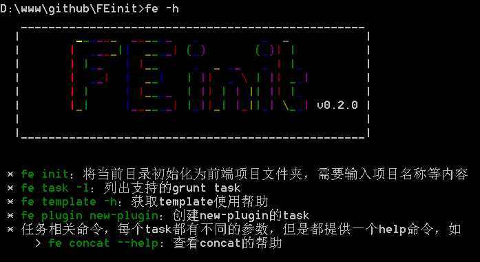

FEinit beta版
======


基于Grunt和compass的前端项目工具集，因为是在windows系统开发，所以目前仅适合 __windows__ 系统。

主要功能：
 * 提供前端项目中常用的工具集
    * 相对于grunt的task文件形式，FEinit的task是在命令行执行
    * 适合临时性、零碎的task需求
 * 通过template快速创建（前端）项目
 * 提供插件机制，每个FEer都可以开发自己的fe工具

环境要求：
  * 安装了nodejs
  * 并且把nodejs添加到环境变量
  * compass和sass需要ruby支持，我用的版本是2.0
  * 添加右键如果失败，请更换管理组用户重试

开发匆忙，难免有bug，可以在线提issue

## 安装

```shell
npm install http://github.com/ksky521/FEinit/tarball/master -g
fe -h
fe -v
```
__P.S.__：安装最后会选择是否添加鼠标右键功能

## 使用
 * 第一种方法：鼠标右键选择要创建项目的文件夹，选择【初始化FE】，然后按照提示完成项目的创建过程
 * 第二种方法：cmd进入要创建项目的文件夹，执行：```fe init```

### fe -h or fe --help
查看帮助文件

## template功能
生成（前端）项目的默认文件，可以指定自己电脑任意文件夹为项目模板（称为template），使用时：

 * 进入要创建项目的文件夹
 * 执行 ```fe init templateName``` 
 * fe自动复制对应的template文件夹所有文件到当前路径

__P.S.__：```fe init``` 和 右键菜单创建项目，则为默认的template（可以设置）

### template帮助

```shell
fe template -h
```
#### fe自带默认项目的src文件夹结构如下

    │  index.html             //首页
    │
    ├─img                    //图片
    │  └─pic                 //切图临时占位图片       
    ├─js                     //js文件夹
    │      jquery.1.4.2.js 
    │      jquery.1.8.2.js    
    │      zepto.js
    │
    └─sass                   //compass sass文件夹
            _base.scss       //compass bass文件


## 支持的task
列出支持的task命令

所有task支持查看帮助，使用 ```fe taskName -h``` 获取帮助，例如：

```shell
## 获取concat的帮助
fe concat -h
```

### fe concat
##### 功能
合并文件

##### 基本语法

```shell
filename [files..] to dest
## 举例
fe concat file1 file2 file3 to concat
```

### fe css
##### 功能
合并css，支持import语法解析。

##### 基本语法

```shell
fe css [options] filename [folder/files..] to dest.css
## 举例
fe css a.css b.css to ab.css
fe css -c a.css b.css to ab.min.css
```

 * 选项 
   * ```-c``` 压缩
   * ```-u``` 不美化，源文件输出
 * 默认
   * 合并
   * 美化

### fe js 
##### 功能
合并压缩js

##### 基本语法

```shell
fe js [options] filename [folder/files..] to dest.js
## 举例
fe js file.js file2.js to min.js
fe js file.js file2.js to min.js --no-ascii
```

 * 选项 
   * ```-b``` or ```--beautify``` 美化
   * ```--no-ascii``` 不ascii化，即不会讲中文转为 ```\uXXX``` 格式
 * 默认
   * 压缩
   * 合并
   * ascii化


### fe build 
##### 功能
将html中的引入的js和css合并到html中，支持压缩


##### 基本语法

```shell
fe build [options] filename [files..] [to] [dest.html]
## 举例
fe build demo.html demo2.html -b
fe build demo.html to min.html --no-ascii
```

 * 选项 
   * ```-b``` or ```--beautify``` 美化
   * ```--no-ascii``` 不ascii化，即不会讲中文转为 ```\uXXX``` 格式
 * 默认
   * 压缩
   * ascii化

### 常见参数缩写
 * -h: --help     //帮助
 * -l: --list     //列表
 * -c: --create   //创建
 * -e: --edit     //修改
 * -rm: --remove  //删除
 * -v: --version  //版本

## 二次开发
支持二次开发和DIY自己的task，称之为plugin机制，即实现的一种插件机制，通过提供的接口实现一个task功能

命令 ```fe task --list``` 可以显示所有支持的 task 列表。

### 添加一个plugin

```shell
fe plugin my-first-task
```

上面命令在 fe 的tasks文件夹中创建了一个名字为 ```my-first-task.js``` 的文件，打开后您会看到基本内容已经写好了，您要做的就是专注于自己plugin的功能即可。

plugin开发完成后，使用：

```shell
## 查看帮助
fe my-first-task -h 
## 执行命令
fe my-first-task [options] [to] [destOptions] 
```

__P.S.__
 
 * plugin名称为字母和下划线(_)组成，并且不得与之前的task重名
 * 为了跟sheel自带的 ```>``` 区分，使用 ```to``` 作为输出符号


## 卸载

```shell
npm uninstall -g FEinit
```

## 关于作者
 * 微博：[@三水清](http://weibo.com/sanshuiqing)
 * github：[github.com/ksky521](http://github.com/ksky521)
 * 博客：[三水清](http://js8.in)